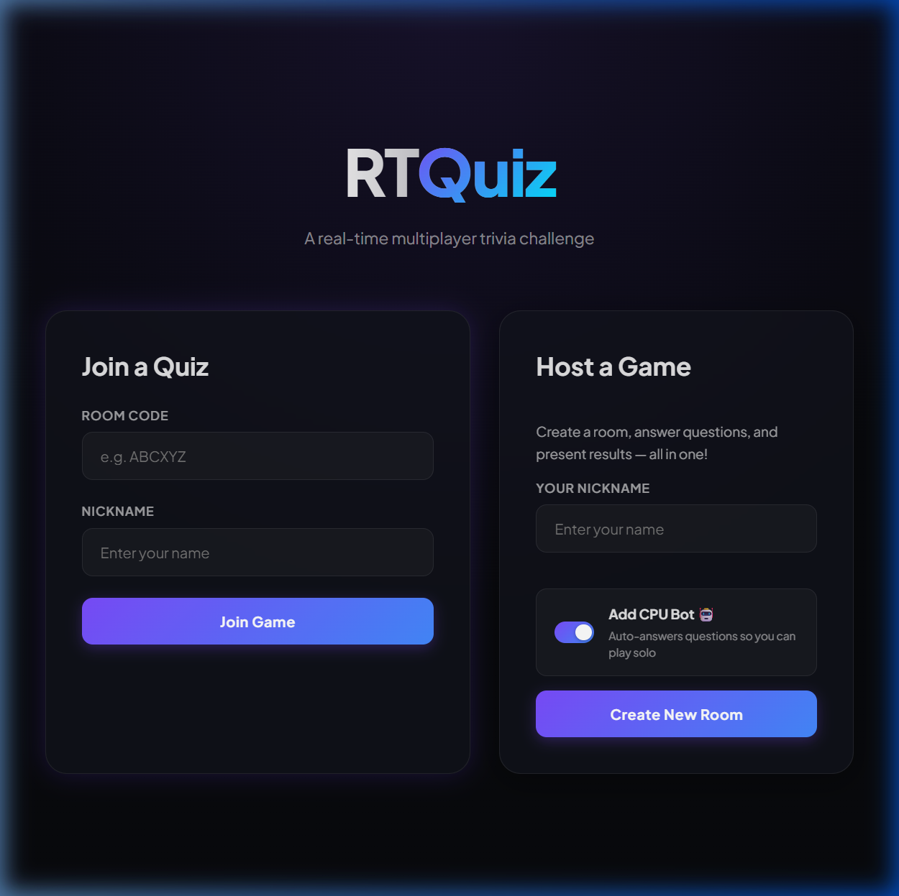
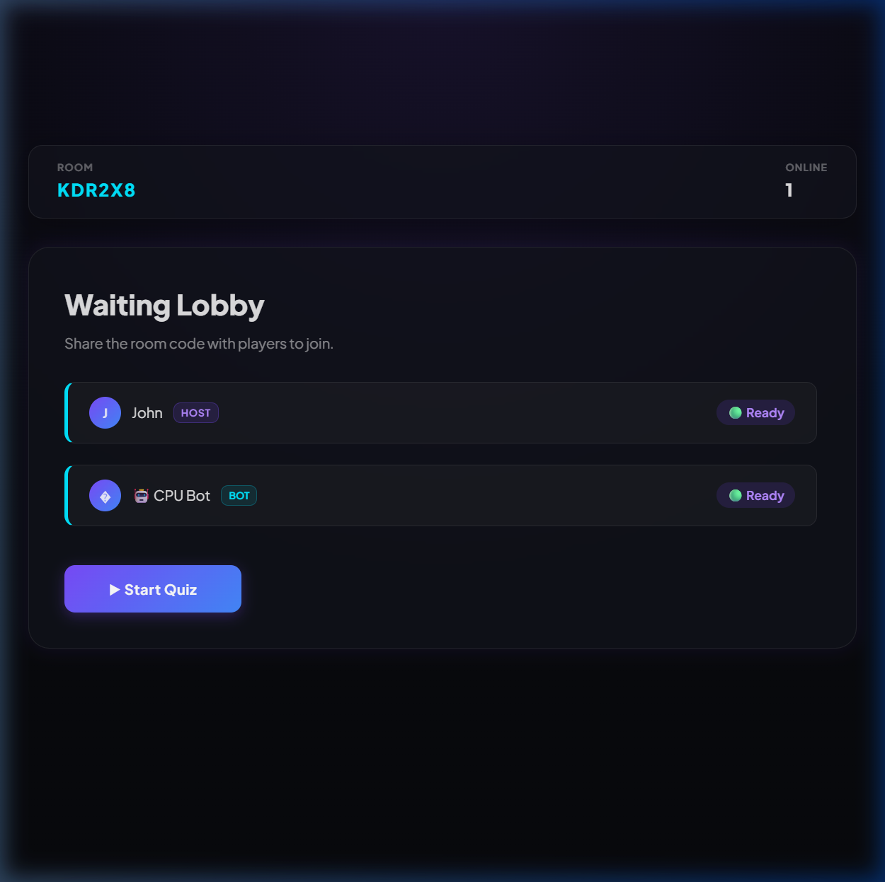
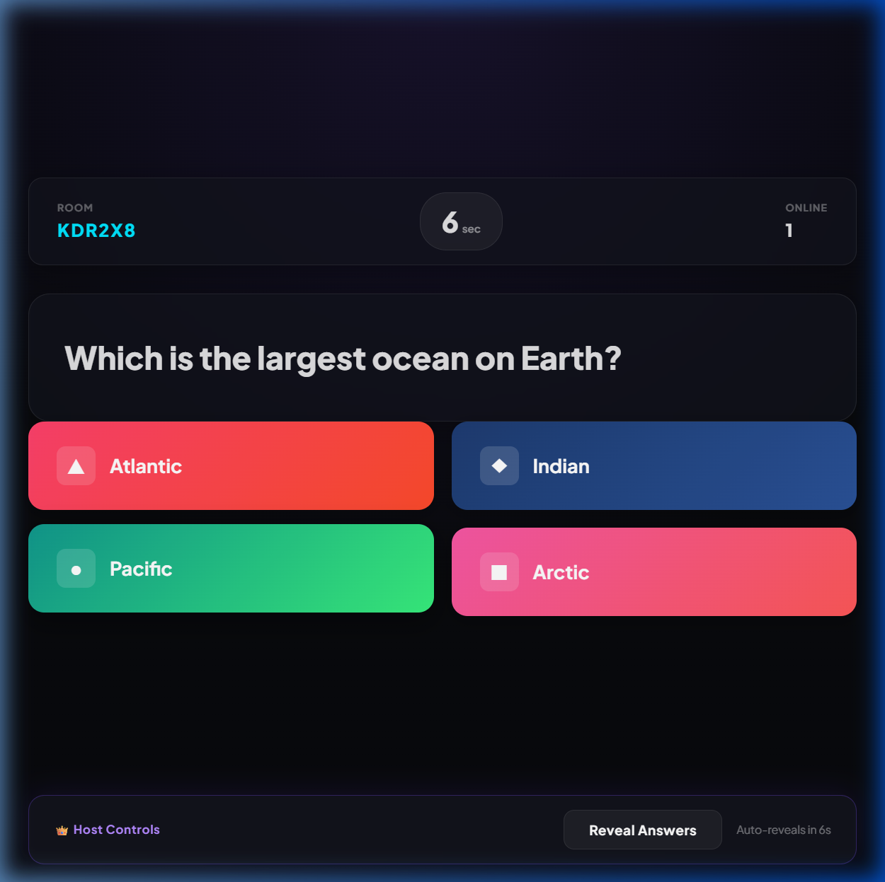
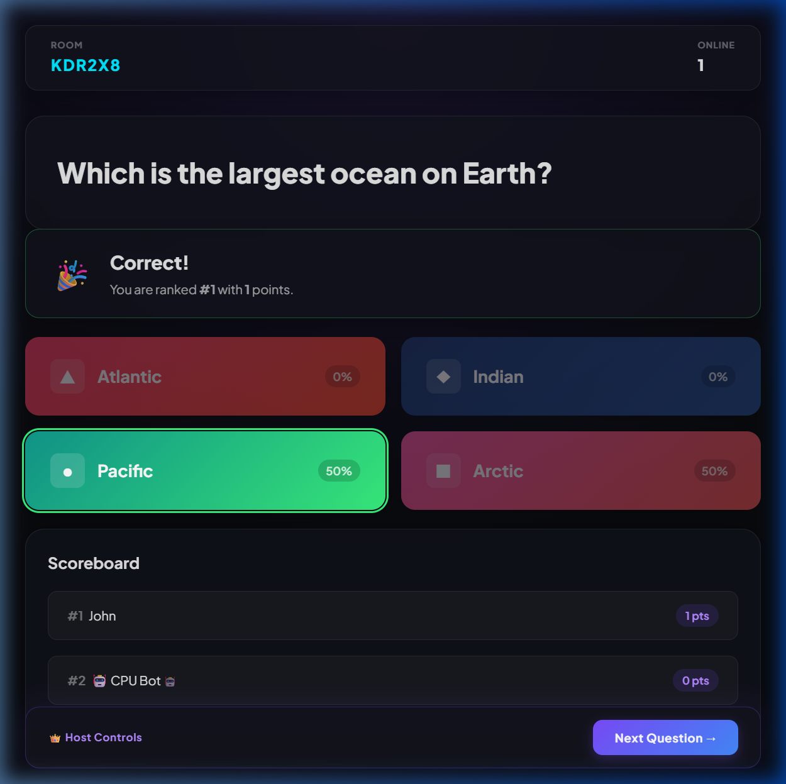
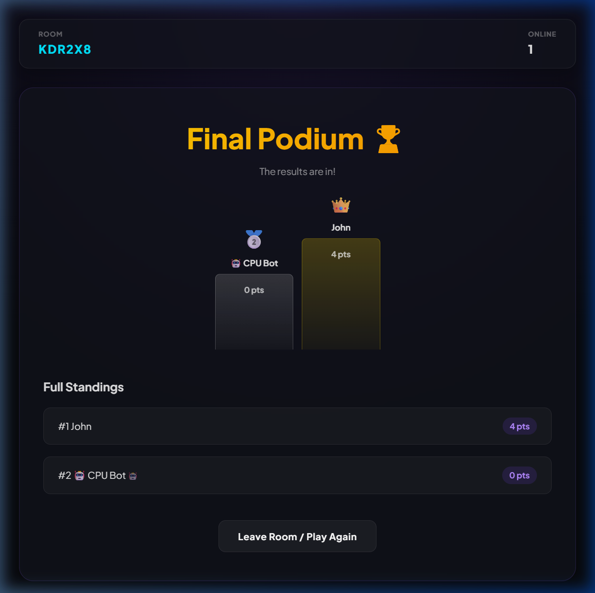

# RTQuiz 🏆

A modern, real-time multiplayer trivia quiz application (similar to Kahoot) built with **.NET Core** and **Vue 3 + TypeScript**. It features real-time state synchronization, a sleek dark-mode glassmorphic UI, host-inclusive gameplay, and a built-in CPU Bot for solo testing.

---

## 📸 Gameplay Walkthrough

### 1. Host or Join a Room
Create a new room, set your nickname, and optionally toggle the **Add CPU Bot** helper to test gameplay solo.

### 2. Waiting Lobby
See connected players in real time. The CPU Bot joins the lobby instantly and prepares to play.

### 3. Answer Questions
Both the host and guests participate in the game simultaneously, selecting answers from a grid before the timer runs out.

### 4. Live Scoreboard
Once answers are revealed, players get instant feedback, see points awarded, and view live scoreboard updates.

### 5. Final Podium
Complete all rounds to reach the final podium, showing the top three players and full standings.

---

## 🌟 Key Features

* **Real-time Synchronization:** Built on top of **SignalR WebSocket connections** to sync game phase, questions, timers, and scoreboards instantly for all players.
* **CPU Bot Support:** Built-in bot player that automatically submits random answers after a human-like delay (1.5s to 4s) so candidate recruiters can test the multiplayer flow completely solo.
* **Host-Inclusive Play:** Unlike traditional quiz sites where the host is only a spectator, the host can also submit answers and participate in the game while retaining dedicated bottom control buttons.
* **Premium User Experience:** Designed with a vibrant, cohesive dark-theme palette, glassmorphism, responsive grid layouts, and clean animations.
* **Resilient State Syncing:** Implements server-side latency compensation for the question countdown timer so network delays don't affect game fairness.

---

## 🛠️ Tech Stack

* **Backend:** .NET Core 9.0 API, C#, SignalR (Real-time Hubs), Clean Architecture principles, xUnit for unit testing.
* **Frontend:** Vue 3 (Composition API), Vite, TypeScript, Vanilla CSS (modular design system).
